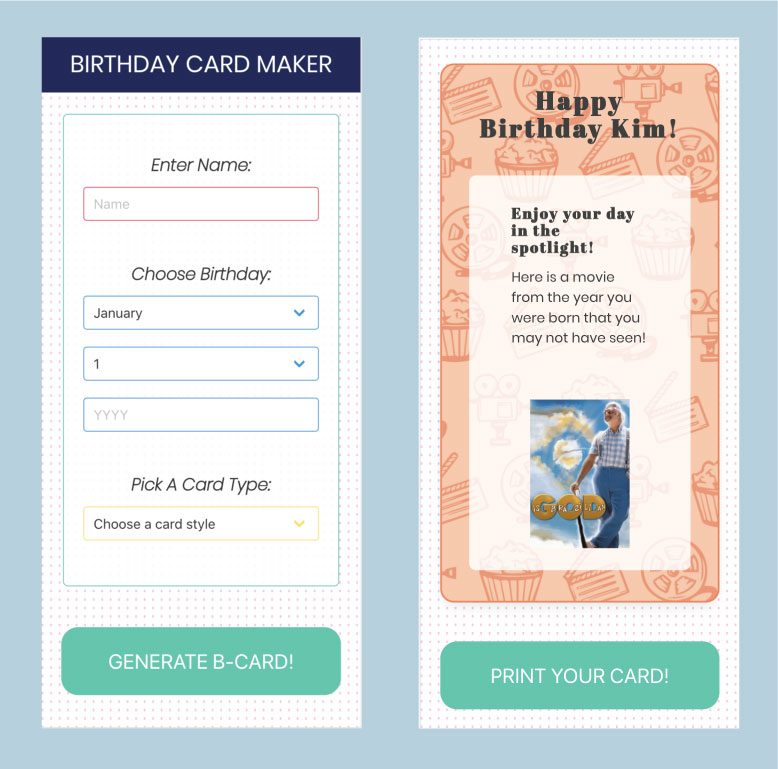

# Birthday Card Generator 

A simple application that allows a user to make a birthday card featuring a fun item related to the recipient's date of birth. 

When the user opens the site, they are presented with an input menu where they are asked to enter the name of the card 
recipient, the card recipient's birth month, day, or year. 

They then can pick their card's theme: books, space, or movies. 

After they click the 'generate bcard!' button, they are given an electronic birthday card featuring: 
-  A title saying happy birthday and the recipient's name
-  Card styling relating to the theme of choice
-  A funny quip relating to the theme of choice 
-  An image relating to the theme of choice 
   - If the user chose books, they recieve a NYT best seller from the recipient's birthday last year
   - If the user chose space, they recieve the nasa image of the day from the recipient's birthday last year
   - If the user chose movies, they recieve a random movie released during the recipient's year that they probably haven't seen
  
The user then is able to click 'print' and can print the card to give to the recipient in person. 

You can preview the application here: https://tmylesc.github.io/bcard/index.html
